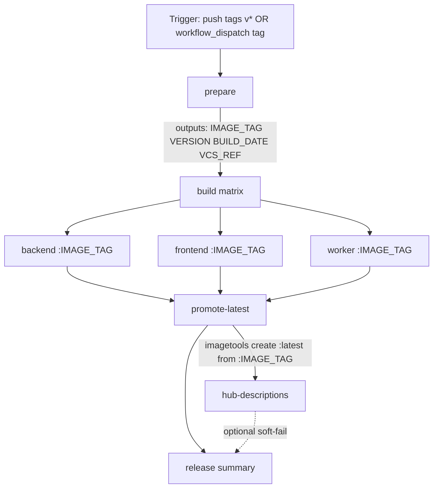

# Research: Splitting the Docker Publish workflow into a job DAG

**Date:** 2026-07-24
**Question:** What is the best way to restructure `.github/workflows/docker-publish.yml` so three multi-arch images (backend, frontend, worker) build in parallel, `:latest` advances only after all succeed, and Docker Hub README updates sit correctly in the DAG — using primary GitHub Actions / Docker docs only?

## Purpose

The current workflow builds and pushes three multi-arch images **serially in one job**, tagging each with both `:${IMAGE_TAG}` and `:latest` in the same `docker/build-push-action` step, then updates three Hub READMEs. That creates a **partial-publish hazard**: if backend succeeds and frontend fails, Hub already has a new `backend:latest` while the release set is incomplete. This note evaluates a prepare → matrix build → promote-latest → hub-descriptions shape against first-party docs, and settles the open `fail-fast` question.

---

## Executive recommendation

**Adopt the locked job shape.** Primary sources support it.

| Locked decision | Verdict | Notes |
| --- | --- | --- |
| **A. Atomic release** (workflow fails if any image fails) | **Keep** | `needs` skips dependents when a required job fails ([workflow syntax — `needs`](https://docs.github.com/en/actions/reference/workflows-and-actions/workflow-syntax#jobsjob_idneeds)). |
| **B. Registry-atomic `:latest`** (build pushes only `:${IMAGE_TAG}`; finalize promotes `:latest`) | **Keep** | Official retag/copy path is `docker buildx imagetools create` ([imagetools create](https://docs.docker.com/reference/cli/docker/buildx/imagetools/create/), [copy between registries](https://docs.docker.com/build/ci/github-actions/copy-image-registries/)). |
| **C. Job shape** prepare → matrix (3 images) → promote-latest → one hub-descriptions job | **Keep** | Matrix is the right DRY/visibility tradeoff for three sibling builds; reusable workflow is optional overkill for a single caller. |
| **Open: `fail-fast`** | **`fail-fast: false`** | Default is `true` (cancels remaining matrix shards on first failure). For release diagnosis of *all* image failures in one run, set `false`. Workflow still fails; promote still skips via `needs`. ([`strategy.fail-fast`](https://docs.github.com/en/actions/reference/workflows-and-actions/workflow-syntax#jobsjob_idstrategyfail-fast)) |

**Minor challenges / refinements (not rejections):**

1. **Version-tag atomicity ≠ `:latest` atomicity.** Pushing `:${IMAGE_TAG}` from matrix shards can still leave a partial version set (e.g. backend+frontend tagged `v1.2.3`, worker missing) if one shard fails. That is acceptable if consumers treat `:latest` as the coordinated “current release” pointer and version tags as per-image artifacts. Full tag-set atomicity would require candidate tags + promote of both `:${IMAGE_TAG}` and `:latest` — stronger than decision B, optional later.
2. **Hub README should sit after promote, and should not hard-gate image delivery.** Official Docker docs sequence `peter-evans/dockerhub-description` after push ([update Hub description](https://docs.docker.com/build/ci/github-actions/update-dockerhub-desc/)) but do not require it to fail the release. Prefer `needs: promote-latest` plus `continue-on-error: true` on the descriptions job (or soft-fail steps) so Hub API flake does not force a rebuild.
3. **Concurrency must not cancel in-progress publishes.** Use a per-tag concurrency group with `cancel-in-progress: false` (or omit cancel). Cancelling mid-push is worse than queuing ([concurrency](https://docs.github.com/en/actions/how-tos/write-workflows/choose-when-workflows-run/control-workflow-concurrency)).

---

## Recommended job DAG



ASCII equivalent:

```
prepare
   |
   v
build (matrix: backend | frontend | worker)
   |  push only :${IMAGE_TAG}  (+ registry buildcache)
   |  fail-fast: false
   v
promote-latest   <--- needs: build (all shards success)
   |  imagetools create :latest  (×3 repos)
   v
hub-descriptions  <--- needs: promote-latest
   |  peter-evans ×3  (prefer soft-fail)
   v
summary / notify
```

**Triggers (unchanged):** `push.tags: ["v*"]` + `workflow_dispatch` with `tag` input. Do **not** add `release: published` (already solved double-trigger with Release Tag on Merge).

---

## Decision table

| Option | Tradeoff | Recommendation |
| --- | --- | --- |
| **One serial job** (status quo) | Simple logs; slow wall-clock; `:latest` advanced per image before siblings finish | **Reject** for release publish |
| **Three separate jobs** (no matrix) | Max clarity per job name; duplicated setup/login/cache lines | Acceptable; worse DRY than matrix |
| **Matrix job (3 images)** | DRY; parallel; one status for “all builds”; per-shard setup still required | **Prefer** |
| **Reusable workflow per image** | DRY across repos/callers; secrets/`workflow_call` ceremony; nesting limits | Overkill unless reused elsewhere |
| **Matrix + reusable** | Supported ([reuse workflows](https://docs.github.com/en/actions/how-tos/reuse-automations/reuse-workflows#using-a-matrix-strategy-with-a-reusable-workflow)) | Only if step YAML grows large |
| **`fail-fast: true`** (default) | Saves minutes; cancels siblings; hides second/third failures | Poor for release diagnosis |
| **`fail-fast: false`** | All shards finish; more minutes/cost; full failure signal | **Prefer for publish** |
| **Push `:tag` + `:latest` in build** | Convenient; partial `:latest` on sibling failure | **Do not** |
| **Push `:tag` only; promote `:latest`** | Extra job; registry-atomic floating tag | **Do** |
| **Candidate tags → promote both `:tag` and `:latest`** | Strongest atomicity; more retag complexity | Optional later |
| **Hub README in build job** | Couples docs to build; runs even if other images fail (serial) or races matrix | **Do not** |
| **Hub README after promote** | Docs reflect a coordinated latest set | **Do** |
| **Hub README hard-fails release** | Strict Hub listing quality; flaky Hub API forces re-run of promote | Soft-fail preferred |
| **Job outputs for IMAGE_TAG** | Clean string pass; 1 MB/job limit | **Do** for metadata |
| **Artifacts for `.env.production`** | Correct for files across jobs | **Do** if prepare owns the file; else recreate in each shard |
| **Share Buildx/QEMU across jobs** | Not possible on isolated GHA runners | Recreate per matrix shard; share via **registry cache** |

---

## Primary-source findings

### 1. Matrix vs separate jobs vs reusable workflow

**Matrix** creates one job run per combination and is the documented way to fan out related work ([run job variations](https://docs.github.com/en/actions/how-tos/write-workflows/choose-what-workflows-do/run-job-variations), [`strategy.matrix`](https://docs.github.com/en/actions/reference/workflows-and-actions/workflow-syntax#jobsjob_idstrategymatrix)). Downstream jobs can `needs` the matrix job; GitHub waits for **all** matrix shards before considering the needed job complete, and skips dependents if any required job failed ([`needs`](https://docs.github.com/en/actions/reference/workflows-and-actions/workflow-syntax#jobsjob_idneeds)).

**Visibility:** each matrix shard appears as its own check/run in the Actions UI — better than three serial steps in one job.

**DRY / secrets:** matrix shares one job definition; repository secrets (`DOCKERHUB_*`) are available to every shard. No special secret plumbing beyond normal workflow secrets.

**Caching:** each shard is a **separate runner**. Local Buildx state is not shared ([share image between jobs](https://docs.docker.com/build/ci/github-actions/share-image-jobs/) — isolation is explicit). The supported cross-job cache for this repo is already **registry cache** (`cache-from` / `cache-to` `type=registry`, `*:buildcache`), which works across parallel shards ([build-push-action cache inputs](https://github.com/docker/build-push-action#inputs)).

**Reusable workflows:** useful when multiple callers need the same build. Secrets must be passed or `secrets: inherit` ([reuse workflows](https://docs.github.com/en/actions/how-tos/reuse-automations/reuse-workflows)). Matrix can call a reusable workflow. For a single publish workflow with three images, an **inline matrix** is simpler and sufficient.

**Fit for this repo:** matrix over `image: [backend, frontend, worker]` with `include` rows for `context`, `file`, `image_name`, Hub README path — one definition, three parallel builds.

### 2. `fail-fast` behavior and recommendation

From the workflow syntax reference ([`jobs.<job_id>.strategy.fail-fast`](https://docs.github.com/en/actions/reference/workflows-and-actions/workflow-syntax#jobsjob_idstrategyfail-fast)):

> If `fail-fast` is set to `true` … GitHub will **cancel all in-progress and queued jobs in the matrix** if any job in the matrix fails. This property **defaults to `true`**.

With `fail-fast: false`, remaining shards keep running after a failure (see also [handling failures](https://docs.github.com/en/actions/how-tos/write-workflows/choose-what-workflows-do/run-job-variations#handling-failures)).

**Recommendation for this publish pipeline: `fail-fast: false`.**

Reasons tied to primary behavior:

- Release failures are often environmental (Hub auth, one Dockerfile, QEMU). Seeing **all three** outcomes in one run beats cancelling siblings after the first failure.
- **Atomic `:latest` does not depend on fail-fast.** Promotion is gated by `needs: build`; any failed shard prevents promote ([`needs`](https://docs.github.com/en/actions/reference/workflows-and-actions/workflow-syntax#jobsjob_idneeds)).
- Cost of three multi-arch builds is already paid on happy path; cancel-on-first-fail saves wall-clock only on the failure path, at the expense of diagnosis.

Do **not** use `continue-on-error: true` on build shards — that would mark the matrix job successful and incorrectly allow promote.

### 3. Promoting `:latest` without rebuild (`imagetools create`)

Docker’s first-party guidance for creating a new tag/manifest from existing registry content is:

```bash
docker buildx imagetools create \
  --tag user/app:latest \
  user/app:1.0.0
```

Documented behaviors ([imagetools create](https://docs.docker.com/reference/cli/docker/buildx/imagetools/create/)):

- Creates a **new manifest list / index** based on **source manifests that must already exist in the registry**.
- If the single source is already a manifest list/index, create performs a **carbon copy** (ideal for multi-arch images already pushed as an index).
- `--dry-run` shows the result without pushing — use in verification.
- Official GHA example uses the same command to copy multi-platform images to another registry/tag set ([copy image between registries](https://docs.docker.com/build/ci/github-actions/copy-image-registries/)).

**Caveats to verify in dry-run:**

| Topic | What docs imply | Practical note |
| --- | --- | --- |
| Multi-arch | Source must be the pushed index (buildx multi-platform push) | Matches current `platforms: linux/amd64,linux/arm64` + `push: true` |
| Attestations | Provenance/SBOM are attached at build/push time ([attestations](https://docs.docker.com/build/ci/github-actions/attestations/)); imagetools carbon-copies the index | Prefer promoting by **digest** from `build-push-action` `digest` output for precision |
| Cache | Registry `buildcache` tags are independent of `:latest` | No change required |
| Rebuild | imagetools does **not** rebuild layers | Meets “promote without rebuild” |

Illustrative promote step (design only):

```yaml
# After login + setup-buildx (no QEMU needed for imagetools-only)
- run: |
    docker buildx imagetools create \
      --tag "${USER}/fastapi-rbac-backend:latest" \
      "${USER}/fastapi-rbac-backend:${IMAGE_TAG}"
  # repeat for frontend + worker
```

Prefer digest form when available: `"${USER}/fastapi-rbac-backend@${DIGEST}"` as source.

### 4. Partial publish hazard

**Status quo hazard:** `build-push-action` `tags` is a list; both version and `latest` are pushed when that step succeeds ([build-push-action inputs](https://github.com/docker/build-push-action#inputs)). In a serial job, a later image failure leaves earlier images’ `:latest` already moved. Parallel jobs with the same tagging make that race worse.

**What Actions guarantees:** job dependency success, not registry transactional multi-repo updates. There is **no** GitHub/Docker Hub API that atomically updates three repositories’ floating tags together. The supported pattern is:

1. Push **immutable** (or release-specific) tags from builds.
2. Gate floating tags (`:latest`) behind a job that `needs` **all** builds ([`needs`](https://docs.github.com/en/actions/reference/workflows-and-actions/workflow-syntax#jobsjob_idneeds)).
3. Retag with `imagetools create` ([docs](https://docs.docker.com/reference/cli/docker/buildx/imagetools/create/)).

**Residual risk:** successful shards still publish `:${IMAGE_TAG}` even if a sibling fails (`fail-fast: false` makes this more visible). That is usually desirable (inspectable artifacts) and safer than moving `:latest`. Document that a failed release may leave orphan version tags; re-run overwrites the same tag after fix.

### 5. Where Hub README updates should sit

Docker’s official GHA example runs `peter-evans/dockerhub-description` **after** build/push in the same job ([update Docker Hub description](https://docs.docker.com/build/ci/github-actions/update-dockerhub-desc/)). The action itself only needs Hub credentials + a checked-out README path ([peter-evans/dockerhub-description](https://github.com/peter-evans/dockerhub-description)).

**Sequencing for this DAG:**

| Placement | Pros | Cons |
| --- | --- | --- |
| Inside each matrix shard | Docs update even if other images fail | Docs can describe a version that never became a full release; duplicates login |
| After builds, before promote | Docs update for version tags without waiting on `:latest` | Still updates on a release that never promoted `:latest` |
| **After promote** | Hub listing updates only when floating tags moved | README failure appears “late” |

**Recommendation:** one `hub-descriptions` job with `needs: [promote-latest]`.

**Should README failure fail the release?** Primary sources do not define “release success.” Product guidance:

- Image delivery atomicity is already decided by build + promote.
- Hub description is **repository metadata**, truncated/limited by Hub (25k README / 100-byte short description — action docs).
- Prefer **soft-fail** (`continue-on-error: true` on the job or steps) + a loud job summary, so Hub API issues do not require rebuilding multi-arch images. If Hub listing quality is part of the release checklist, hard-fail is acceptable *after* promote (images already correct).

### 6. Prepare job outputs vs artifacts

| Data | Mechanism | Source |
| --- | --- | --- |
| `IMAGE_TAG`, `VERSION`, `BUILD_DATE`, `VCS_REF` | **`jobs.prepare.outputs`** → `needs.prepare.outputs.*` | [Pass job outputs](https://docs.github.com/en/actions/how-tos/write-workflows/choose-what-workflows-do/pass-job-outputs); [outputs limits](https://docs.github.com/en/actions/reference/workflows-and-actions/workflow-syntax#jobsjob_idoutputs) (1 MB/job, 50 MB/run) |
| `backend/.env.production` (file) | **Artifact** upload/download, **or** recreate the same `cp` in each matrix shard | [Store/share artifacts](https://docs.github.com/en/actions/tutorials/store-and-share-data); Docker docs on sharing images use the same artifact pattern for tarballs ([share image jobs](https://docs.docker.com/build/ci/github-actions/share-image-jobs/)) |

**Path context reminder:** `build-push-action` default Git context **ignores file mutations** before the build; this workflow already uses path `context:` + checkout, which is required for `.env.production` ([build-push-action README — Path context](https://github.com/docker/build-push-action#path-context)). Keep path context on matrix builds.

**Practical split for this repo:**

- prepare: resolve tag, validate Dockerfiles/README paths, optionally create + upload `.env.production` artifact, emit outputs.
- build shards: checkout (or download env artifact), setup QEMU/Buildx, login, build/push `:${IMAGE_TAG}` only.
- Do **not** put secrets in job outputs (redacted / skipped — [outputs docs](https://docs.github.com/en/actions/reference/workflows-and-actions/workflow-syntax#jobsjob_idoutputs)).

`docker/metadata-action` is optional for tag/label generation ([attestations example uses it](https://docs.docker.com/build/ci/github-actions/attestations/)); not required if prepare already owns `IMAGE_TAG`.

### 7. Permissions, login, and Buildx per matrix shard

Official multi-platform GHA examples run **login + setup-qemu + setup-buildx + build-push** in the **same job** ([multi-platform GHA](https://docs.docker.com/build/ci/github-actions/multi-platform/), [setup-buildx](https://github.com/docker/setup-buildx-action), [setup-qemu](https://github.com/docker/setup-qemu-action)). QEMU should be registered **before** Buildx on the runner ([setup-qemu note](https://github.com/docker/setup-qemu-action#usage)).

**Cannot share across jobs on GitHub-hosted runners:** each job is a fresh VM; Buildx cleanup defaults to removing the builder at job end (`cleanup: true` on setup-buildx). Therefore **each matrix shard must**:

1. `actions/checkout` (path context)
2. `docker/setup-qemu-action` (for `linux/arm64` under emulation)
3. `docker/setup-buildx-action`
4. `docker/login-action` with `DOCKERHUB_USERNAME` / `DOCKERHUB_TOKEN`
5. `docker/build-push-action` with per-image registry cache refs

**Promote job** needs login + Buildx (for `imagetools`), typically **not** QEMU.

**Permissions:** current `contents: read` is enough for checkout-based publish to Docker Hub. `packages: write` is only needed for GHCR; keep or drop based on whether GHCR remains unused.

### 8. Concurrency and re-runs

Concurrency groups ensure at most one run in a group executes at a time; `cancel-in-progress: true` cancels the running one ([concurrency how-to](https://docs.github.com/en/actions/how-tos/write-workflows/choose-when-workflows-run/control-workflow-concurrency), [syntax](https://docs.github.com/en/actions/reference/workflows-and-actions/workflow-syntax#concurrency)).

**For tag-triggered publish, recommend:**

```yaml
concurrency:
  group: docker-publish-${{ github.workflow }}-${{ github.event.inputs.tag || github.ref }}
  cancel-in-progress: false
```

Rationale:

- Prevent two publishes of the same tag from interleaving Hub pushes / `:latest` promotes.
- **Do not cancel** an in-progress multi-arch push (partial registry writes are worse than waiting).
- Include `github.workflow` so this group does not collide with unrelated workflows ([docs guidance](https://docs.github.com/en/actions/how-tos/write-workflows/choose-when-workflows-run/control-workflow-concurrency#example-only-cancel-in-progress-jobs-or-runs-for-the-current-workflow)).

**Re-run after partial version-tag pushes:**

- Re-run rebuilds and re-pushes `:${IMAGE_TAG}` (overwrite same tag) for shards that run again.
- With decision B, `:latest` only moves in `promote-latest` after **all** shards succeed — a failed run should leave `:latest` on the previous good release.
- Orphan `:${IMAGE_TAG}` from a failed attempt is expected; fixed by a successful re-run of the same tag (or deleting Hub tags manually — [Hub tags](https://docs.docker.com/docker-hub/repos/manage/hub-images/tags/)).

### 9. Concrete DAG for this repo’s constraints

| Constraint | Design choice |
| --- | --- |
| Triggers: `v*` + `workflow_dispatch` | Unchanged; compute `IMAGE_TAG` in prepare |
| Images: `fastapi-rbac-{backend,frontend,worker}` | Matrix `include` rows |
| Platforms: `linux/amd64,linux/arm64` | Per-shard `platforms` + QEMU + Buildx |
| Registry: Docker Hub | `docker/login-action` each build + promote (+ descriptions) |
| Cache: `*:buildcache` | Keep per-image `cache-from` / `cache-to` `mode=max` |
| No double-trigger with GitHub Release | Keep tag-push-only (no `release:` event) |
| Atomic release | `promote-latest` and summary `needs: build`; no `continue-on-error` on builds |
| Atomic `:latest` | Build tags **only** `:${IMAGE_TAG}`; promote with `imagetools create` |

Matrix sketch (not full workflow):

```yaml
strategy:
  fail-fast: false
  matrix:
    include:
      - image: backend
        context: ./backend
        file: ./backend/Dockerfile.prod
        name: fastapi-rbac-backend
      - image: frontend
        context: ./react-frontend
        file: ./react-frontend/Dockerfile.prod
        name: fastapi-rbac-frontend
      - image: worker
        context: ./backend
        file: ./backend/queue.dockerfile.prod
        name: fastapi-rbac-worker
```

---

## Do not do (anti-patterns)

1. **Do not** push `:latest` from matrix/build steps when siblings can still fail.
2. **Do not** rely on serial step order in one job for “atomicity” across images — a mid-job failure already published earlier tags.
3. **Do not** set `continue-on-error: true` on build shards if promote must be gated.
4. **Do not** set workflow `concurrency.cancel-in-progress: true` for tag publishes (risk of interrupting pushes).
5. **Do not** expect Buildx/QEMU/login to be shared across jobs — re-setup per shard.
6. **Do not** use default Git context if the build depends on a generated `.env.production` ([path context](https://github.com/docker/build-push-action#path-context)).
7. **Do not** put Hub tokens in job outputs.
8. **Do not** add `release: published` as a second trigger (double-build with Release Tag on Merge).
9. **Do not** treat Hub README success as a substitute for image promote success — or the reverse; keep them separate jobs.
10. **Do not** use `fail-fast: true` if the goal of a failed release run is “see every broken image.”

---

## Open risks / verify with a dry-run

| Risk | How to verify |
| --- | --- |
| `imagetools create` carbon-copy preserves multi-arch index + attestations on Docker Hub | Promote with `--dry-run`, then real promote on a non-prod tag; `docker buildx imagetools inspect` before/after |
| Digest vs tag source for promote | Capture `digest` output from `build-push-action`; promote by digest once |
| Matrix + `needs` skips promote on single shard failure | Force one Dockerfile failure; confirm promote/hub jobs skipped; confirm `:latest` unchanged |
| Partial `:${IMAGE_TAG}` left after failure | Confirm acceptable; document re-run behavior |
| Hub description soft-fail | Simulate bad token on descriptions job; confirm images remain promoted |
| Concurrency with simultaneous tag push + manual dispatch same tag | Confirm second run waits rather than cancelling |
| `.env.production` via artifact vs recreate | Either works; dry-run both; prefer recreate if file is a simple `cp` from example |
| Runner minutes / QEMU time with `fail-fast: false` | Accept on failure path; optional later: native `ubuntu-24.04-arm` split ([Docker GitHub Builder](https://docs.docker.com/build/ci/github-actions/multi-platform/)) — out of scope for this split |
| Provenance exposing build-args | Public repos get `mode=max` provenance by default ([attestations](https://docs.docker.com/build/ci/github-actions/attestations/)); ensure secrets are not passed as build-args (current build-args are dates/refs/version — OK) |

---

## References (primary)

- GitHub Actions — matrix / fail-fast: <https://docs.github.com/en/actions/how-tos/write-workflows/choose-what-workflows-do/run-job-variations>
- GitHub Actions — workflow syntax (`needs`, `outputs`, `fail-fast`, `concurrency`): <https://docs.github.com/en/actions/reference/workflows-and-actions/workflow-syntax>
- GitHub Actions — job outputs: <https://docs.github.com/en/actions/how-tos/write-workflows/choose-what-workflows-do/pass-job-outputs>
- GitHub Actions — concurrency: <https://docs.github.com/en/actions/how-tos/write-workflows/choose-when-workflows-run/control-workflow-concurrency>
- GitHub Actions — artifacts: <https://docs.github.com/en/actions/tutorials/store-and-share-data>
- GitHub Actions — reusable workflows: <https://docs.github.com/en/actions/how-tos/reuse-automations/reuse-workflows>
- Docker — `buildx imagetools create`: <https://docs.docker.com/reference/cli/docker/buildx/imagetools/create/>
- Docker — multi-platform GHA: <https://docs.docker.com/build/ci/github-actions/multi-platform/>
- Docker — copy/retag with imagetools: <https://docs.docker.com/build/ci/github-actions/copy-image-registries/>
- Docker — share images between jobs: <https://docs.docker.com/build/ci/github-actions/share-image-jobs/>
- Docker — Hub description action example: <https://docs.docker.com/build/ci/github-actions/update-dockerhub-desc/>
- Docker — attestations in GHA: <https://docs.docker.com/build/ci/github-actions/attestations/>
- Docker Hub — tags: <https://docs.docker.com/docker-hub/repos/manage/hub-images/tags/>
- `docker/build-push-action`: <https://github.com/docker/build-push-action>
- `docker/setup-buildx-action`: <https://github.com/docker/setup-buildx-action>
- `docker/setup-qemu-action`: <https://github.com/docker/setup-qemu-action>
- `peter-evans/dockerhub-description`: <https://github.com/peter-evans/dockerhub-description>
- Current workflow: [`.github/workflows/docker-publish.yml`](../../.github/workflows/docker-publish.yml)
